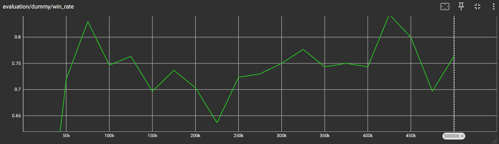

# Gwent

Slightly simplified version of the card game from *The Witcher 3: Wild Hunt*: [https://witcher.fandom.com/wiki/Gwent](https://witcher.fandom.com/wiki/Gwent).

## Overview

This repo implements Gwent as a reinforcement-learning environment and trains a Dueling Double DQN agent to play it. The game engine handles rules, legal moves, and state encoding; training runs thousands of parallel matches with a curriculum that moves from random and heuristic opponents to self-play against snapshots of earlier checkpoints. A desktop GUI lets you play against a trained model. 

## Deep Q-Learning

### Setup

Gwent is treated as a 2 player, turn based Markov Decision Process. 

- State $s \in \mathbb{R}^d$, where $d = \texttt{statesize}$ (currently 305, derived from the game: setup mimics what the player sees, no cheating😄).
- Action $a \in 0, ..., A - 1$, $A = \texttt{actionsize}$ (currently 88: card types to play, special card targets, pass, skip redraw).
- Legal mask $m(s) \in 0,1^A$: allowed actions
- Reward $r_t$: functionality for reward shaping exists but only having +1/-1/-1 for W/D/L seemed to work the best.
- Discount factor $\gamma$: rewards $k$ steps ahead are scaled by $\gamma^k$.

Two identical Dueling Q-networks:

- Policy net $Q_P$: updated each training step by gradient descent.
- Target net $Q_T$: frozen between syncs; weights copied from $Q_P$ every `TARGET_UPDATE_EVERY` episodes.

DQN Architecture:

Shared feature layers: $d = 305 \xrightarrow{\text{Lin}} 128 \xrightarrow{\text{ReLU}} 128 \xrightarrow{\text{Lin}} 128$  
Value head: $128 \xrightarrow{\text{Lin}} 64 \xrightarrow{\text{ReLU}} 1$  
Advantage head: $128 \xrightarrow{\text{Lin}} 64 \xrightarrow{\text{ReLU}} A$

Learner transitions are stored in `ReplayBuffer` as tuples $(s, a, r, s', \texttt{done})$ and sampled uniformly at random.

Hyperparameters listed in **Configuration**.

### Algorithm

**Step 1. Dueling Q-value**  
On a forward pass, the network outputs a state value $V_P(s)$ and per-action advantages $A_P(s,a)$. These are combined into Q-values for every action:

$$
Q_P(s,a) = V_P(s) + \left(A_P(s,a) - \bar{A}_P(s)\right)
$$

where $\bar{A}_P(s)$ is the mean advantage over **legal** actions in $s$.

Illegal actions are masked before $\arg\max$:

$$
Q_{\mathrm{masked}}(s,a) =
\begin{cases}
Q_P(s,a) & m(s)_a = 1 
-\infty & \text{otherwise}
\end{cases}
$$

**Step 2. Action selection**  
Training uses *Epsilon-Greedy Algorithm* on the policy net. (Evaluation, snapshot opponents, and GUI opponent use greedy: $\varepsilon = 0$).

$$
a =
\begin{cases}
\text{uniform random from } L(s) & \text{with probability } \varepsilon 
\arg\max_{a \in L(s)} Q_{\mathrm{masked}}(s,a) & \text{otherwise}
\end{cases}
$$

where $L$ is the set of legal actions.

Per completed episode:

$$
\text{decay} = \left(\frac{\varepsilon_{\min}}{\varepsilon_0}\right)^{1/N}, \qquad \varepsilon \leftarrow \max(\varepsilon_{\min}, \varepsilon \cdot \text{decay})
$$

where $\varepsilon_0$ is the initial exploration rate, $\varepsilon_{\min}$ is the minimum exploration rate, and $N$ = total training episodes.

**Step 3. Temporal Difference target (Double DQN)**  
Sample a minibatch of size $B$ uniformly from replay. The next action $a^*$ is chosen with $Q_P$, but its value is read from $Q_T$. For each transition:

$$
\hat{Q} = Q_P(s,a)
$$

$$
a^* = \arg\max_{a' \in L(s')} Q_{P\mathrm{masked}}(s', a')
$$

$$
y = r + (1 - d)\gamma Q_T(s', a^*)
$$

- $B = 256$: minibatch size (`batch_size`)
- $(s, a, r, s', d)$: one sampled transition: $s'$ is the next learner-perspective state, $r$ is reward since the previous learner step, $d = 1$ if the match ended
- $\hat{Q}$: policy-net estimate of how good action $a$ was in state $s$
- $a^*$: best legal next action according to $Q_{P\mathrm{masked}}$ in $s'$
- $y$ (TD target): reward + discounted future value or just $r$ when $d = 1$

**Step 4. Loss and Update**

Mean squared error (MSE) loss:

$$
\mathcal{L} = \frac{1}{B} \sum_{i=1}^{B} (\hat{Q}_i - y_i)^2
$$

Gradients flow only through $Q_P$ (policy net): **Adam** updates its weights. $Q_T$ is not backpropagated, it is synced from $Q_P$ every `TARGET_UPDATE_EVERY` episodes.

`train_step()` runs every `TRAIN_EVERY` environment steps, `TRAIN_STEPS_PER_UPDATE` times per trigger.

### Training and Evaluation

The training loop consists of `NUM_ENVS` parallel matches.  
Training follows a **curriculum**:


| Phase    | Fraction ballpark | Opponent                                  |
| -------- | ----------------- | ----------------------------------------- |
| `random` | first 5-15%       | uniform random legal moves                |
| `dummy`  | next 10-25%       | decent heuristic (`dummy_action`)         |
| `frozen` | remaining 60-85%  | greedy play from frozen learner snapshots |


`random` and `dummy` are simple sparring partners added to bootstrap training. They’re not theoretically motivated, but they give the agent easy opponents and decent early experience before frozen self-play kicks in. Symmetric self-play (both players learning) is the obvious next step, though out of scope for this project.

As mentioned in **Setup**, the simple rewards: Win=1.0, Draw=-1.0, Loss=-1.0 got the best results for me.

Training metrics are logged every 250 episodes to `metrics/training_metrics.csv` (overwritten each run) and to timestamped runs under `runs/` for TensorBoard. Every `EVALUATION_EVERY` episodes, greedy eval vs random and dummy is logged to TensorBoard (`evaluation/`), plus vs a frozen snapshot when one is at least `FROZEN_EVALUATION_LAG` episodes old.

After ~500k episodes, the agent plays competently. It learns card synergies: using decoys on spies and medics, reviving spies, etc.  


*Win rate against the dummy opponent during 500k episode training.*

## Requirements

- Python >= 3.12
- [uv](https://docs.astral.sh/uv/) (recommended)


## Installation

```bash
# Clone the repository
git clone https://github.com/osniini/gwent-ai.git
cd gwent

# Install dependencies
uv sync
```


## Usage


### Play (GUI)

```bash
uv run python -m src.gui.app
```

On startup the GUI loads policy weights from [`models/<model>.pth`](src/gui/app.py) ([`src/gui/app.py`](src/gui/app.py)).

### Train an agent

```bash
uv run python train.py
```

When training finishes, policy weights are saved to [`models/<model>.pth`](train.py) ([`train.py`](train.py)).

### View TensorBoard

```bash
uv run tensorboard --logdir runs
```


## Project structure

```
gwent/
├── src/
│   ├── engine/       # Game rules, board, cards, environment
│   ├── ai/           # DQN agent, training utilities, opponents
│   └── gui/          # CustomTkinter UI
├── models/           # Saved agent checkpoints
├── runs/             # TensorBoard logs
├── metrics/          # Training metrics (CSV)
└── train.py          # Training entry point
```


## Configuration

**Match rewards**


| Outcome | Reward                      |
| ------- | --------------------------- |
| Win     | `+1.0` (`MATCH_WIN_REWARD`) |
| Loss    | `-1.0`                      |
| Draw    | `-1.0`                      |


Inactive shaping constants (`ROUND_WIN_REWARD`, `SCORE_DIFF_SCALE`, `CARD_PLAY_COST_SCALE`, etc.) are all `0.0`.

### Agent / DQN


| Parameter         | Value                                      | Notes                                                                |
| ----------------- | ------------------------------------------ | -------------------------------------------------------------------- |
| `gamma`           | `0.995`                                    | discount factor                                                      |
| `learning_rate`   | `0.000125`                                 | Adam on $Q_P$ only                                                   |
| Optimizer         | Adam                                       | PyTorch defaults: `betas=(0.9, 0.999)`, `eps=1e-8`, `weight_decay=0` |
| Loss              | `MSELoss`                                  | on TD target vs $Q_P(s,a)$                                           |
| `batch_size`      | 256                                        | replay minibatch                                                     |
| `memory` capacity | 200000                                     | uniform random sampling                                              |
| `epsilon` (start) | `1.0`                                      | reset at train start                                                 |
| `epsilon_min`     | `0.05`                                     | floor after decay                                                    |
| `epsilon_decay`   | $(\varepsilon_{\min}/\varepsilon_0)^{1/N}$ | per completed episode; $N$ = `NUM_EPISODES`                          |
| Target sync       | full copy                                  | `target_net ← policy_net` every `TARGET_UPDATE_EVERY` episodes       |
| Device            | CUDA if available, else CPU                |                                                                      |


### Training loop (`train.py`)


| Parameter                | Value  | Notes                                                |
| ------------------------ | ------ | ---------------------------------------------------- |
| `NUM_EPISODES`           | 500000 | total learner episodes                               |
| `NUM_ENVS`               | 256    | parallel matches                                     |
| `TRAIN_EVERY`            | 4      | global steps between update blocks                   |
| `TRAIN_STEPS_PER_UPDATE` | 4      | gradient steps per block                             |
| `TARGET_UPDATE_EVERY`    | 250    | target sync, metrics checkpoint, frozen-pool refresh |


### Curriculum (`curriculum.py`)


| Parameter                | Value    | Notes                                                                  |
| ------------------------ | -------- | ---------------------------------------------------------------------- |
| `PHASE1_FRAC`            | `0.05`   | random opponent                                                        |
| `PHASE2_FRAC`            | `0.10`   | dummy heuristic                                                        |
| `OPPO_CHECKPOINT_KEEP`   | 32       | max frozen snapshots retained                                          |
| Frozen opponent sampling | weighted | newer eligible snapshots favoured, newest never sampled if older exist |


### Evaluation (`train.py`, `evaluation.py`)


| Parameter               | Value             | Notes                              |
| ----------------------- | ----------------- | ---------------------------------- |
| `EVALUATION_EVERY`      | 25000             | episodes                           |
| `FROZEN_EVALUATION_LAG` | 5000              | min snapshot age for frozen eval   |
| `EVAL_PARALLEL_ENVS`    | 128               | parallel eval matches              |
| vs `random`             | 300 matches       | always                             |
| vs `dummy`              | 300 matches       | always                             |
| vs `frozen`             | 400 matches       | when an old enough snapshot exists |
| Frozen fallback         | 700 dummy matches | if no eligible snapshot            |


### Logging & outputs


| Path                           | Contents                                                     |
| ------------------------------ | ------------------------------------------------------------ |
| `metrics/training_metrics.csv` | checkpoint metrics every 250 episodes (overwritten each run) |
| `runs/<YYYYMMDD-HHMMSS>/`      | TensorBoard (training + eval)                                |
| `models/<model_name>.pth`      | final policy weights after training                          |


